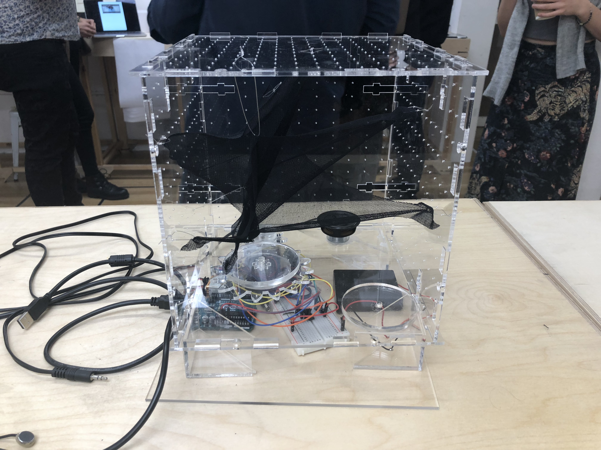
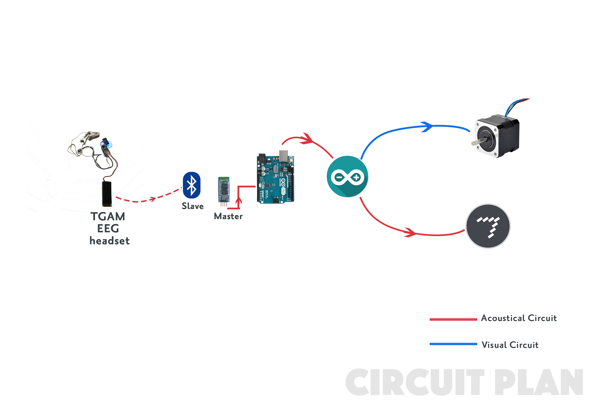

# The-Breath-of-Mind

### What is the Breath of Mind?

'The Breath of Mind' is a EEG-driven device to controls the movement of the stepper and the soundscape. It plans to trap human's brainwaves into this little and physical box. Through the dynamic movement of the fabric and the changing soundscape, this project explores the bluring boundaries of the human and machine. 

### How does it work?

I use the NeuroSky company's ThinkGear chip to detect human's EEG data and transfers it to Arduino through a pair of bluetooth. The value of the attention controls the speed and the direction of the stepper's rotation. Then the stepper is attached with a gear assamble to decrease the speed of the stepper. I make some holes in the gear so that I can hang the fabric on it and make them present a dynamic movement with the rotation of the gears.

